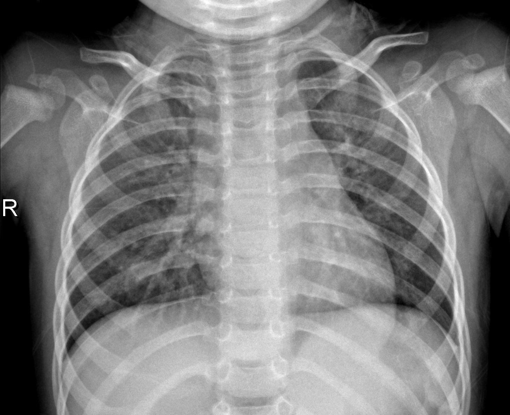
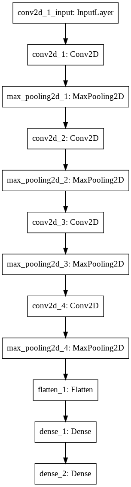

# Module 4 Final Project

<!-- #region -->
## Image Classification with Deep Learning
*Chest x-ray image of normal lungs*

This project involves building a deep neural network that trains on a large dataset for classification on a non-trivial task. In this case, the task is using x-ray images of patients to classify whether or not they have pneumonia.

## The Dataset

The dataset originates from Kermany et al. on [Mendeley](https://data.mendeley.com/datasets/rscbjbr9sj/3). 

The particular subset used for this project is sourced via [Kaggle](https://www.kaggle.com/paultimothymooney/chest-xray-pneumonia). The subset contains 5,863 rgb chest x-ray images, in JPEG format. Images are organized into folders for training, validation, and testing, each of which is split into 'NORMAL' AND 'PNEUMONIA' subfolders.

## Objectives

My aim for this project was not to build a perfect model; rather the intent was to build a working model and to explore how changes to model architecture and hyperperameters can impact model accuracy. In addition, I wanted to make use of cloud computing (in this case, using Google Colab's free GPU and browser - based Jupyter Notebook) and suggest methods for distributing working models to end users.

#### Data Preparation
*Bar plot of test data counts per class*

I acquired project data from Kaggle via API, in a compressed (Zip) format, and read them into directories created within Colab's temporary environment. I then standardized, reshaped, and inspected the image data.

#### Modeling

Using the Keras library, I designed a sequentially layered convolutional neural network with Max Pooling and rectified linear activation functions (ReLU). The model was compiled with an RMSprop optimizer. It is a relatively fast optimizer, which independently adjusts gradient step - size for model weights.

I instantiated 'callbacks' for the model, which programatically saved model weights to the model's history whenever they improved over the previous epoch. In addition, I made use of Keras's ReduceLROnPlateau and EarlyStopping modules, set to either reduce the model's learning rate or to stop the model when its loss did not improve over a set number of epochs.

*Graphical sequence of model layers*

Since the task was binary classification ('NORMAL' OR 'PNEUMONIA'), the model was designed to output to a sigmoid activation layer.

#### Evaluation

After building additional models, I identified the most accurate among them for distribution. I test reloading the model and report its accuracy in the project notebook.

# Featured Notebooks/Analysis

* [`student`: **Jupyter Notebook**](student.ipynb): containing code written for this project and comments explaining it. Obtaining, scrubbing, exploring tasks were relatively straightforward and compact enough that only one notebook was used for all operations.

#### Visualizations & EDA

* Visualizations, with corresponding interpretations are included within the 'student' notebook.

### Non-Technical Presentation

* [presentation.pdf](presentation.pdf) summarizing  methodology and findings

# Technologies
* framework: Google Colab / Jupyter Notebook
* languages: Python
* libraries and modules:
  - ~Mlxtend SequentialFeatureSelector~
  - Numpy
  - OS
  - ~Pandas~
  - ~Pickle~
  - Scikit-Learn:
    * metrics
    * model_selection
  - Yellowbrick classifier
    * roc_auc
* visualization libraries
  - Matplotlib
  - Seaborn
  - Mlxtend plotting

<!-- #endregion -->

## The Deliverables

For online students, your completed project should contain the following four deliverables:

1. A **_Jupyter Notebook_** containing any code you've written for this project. This work will need to be pushed to a public GitHub repository dedicated for this project.

2. An organized **README.md** file in the GitHub repository that describes the contents of the repository. This file should be the source of information for navigating through the repository.

3. A **_[Blog Post](https://github.com/learn-co-curriculum/dsc-welcome-blogging-v2-1)_**.

4. An **_"Executive Summary" PowerPoint Presentation_** that gives a brief overview of your problem/dataset, and each step of the OSEMN process.

Note: On-campus students may have different deliverables, please speak with your instructor.

### Jupyter Notebook Must-Haves

For this project, your Jupyter Notebook should meet the following specifications:

**_Organization/Code Cleanliness_**

* The notebook should be well organized, easy to follow, and code is commented where appropriate.  
    * Level Up: The notebook contains well-formatted, professional looking markdown cells explaining any substantial code. All functions have docstrings that act as professional-quality documentation.  
* The notebook is written to technical audiences with a way to both understand your approach and reproduce your results. The target audience for this deliverable is other data scientists looking to validate your findings.  

**_Process, Methodology, and Findings_**

* Your notebook should contain a clear record of your process and methodology for exploring and preprocessing your data, building and tuning a model, and interpreting your results.
* We recommend you use the OSEMN process to help organize your thoughts and stay on track.

### Visualizations

As usual, the best way to present findings is often visually, and the tips and reminders below should apply to any of these projects.

But please pay special attention to this section if choosing Project \#1 because time series analysis is an area of data science that lends itself well to intuitive data visualizations. Whereas we may not be able to visualize the best choice in a classification or clustering problem with a high-dimensional dataset, that isn't an issue with time series data. As such, **_any findings worth mentioning in this problem are probably also worth visualizing_**.

Your notebook should make use of data visualizations as appropriate to make your findings obvious to any readers. And, when it comes to moving images out of notebooks, make an effort to *export* them rather than taking screen shots. Note e.g. `matplotlib.pyplot.savefig()`, an in-built exportation tool. See [here](https://medium.com/analytics-vidhya/export-images-from-jupyter-notebook-with-a-single-command-422db2b66e92) for more sophisticated possibilities.

Remember that if a visualization is worth creating, then it's also worth taking the extra few minutes to make sure that it is easily understandable and well-formatted. When creating visualizations, make sure that they have:

* A title
* Clearly labeled X and Y axes, with appropriate scale for each
* A legend, when necessary
* No overlapping text that makes it hard to read
* An intelligent use of color -- multiple lines should have different colors and/or symbols to make them easily differentiable to the eye
* An appropriate amount of information -- avoid creating graphs that are "too busy". For instance, don't create a line graph with 25 different lines on it.

There's just too much going on in this graph for it to be readable -- don't make the same mistake! (<a href='http://genywealth.com/wp-content/uploads/2010/03/line-graph.php_.png'>Source</a>)

### Blog Post Must-Haves

Refer back to the [Blogging Guidelines](https://github.com/learn-co-curriculum/dsc-welcome-blogging-v2-1) for the technical requirements and blog ideas.

## The Process

These steps are informed by Smart Vision's1 description of the CRISP-DM process.

### 1. Business Understanding

Start by reading this document, and making sure that you understand the kinds of questions being asked.  In order to narrow your focus, you will likely want to make some design choices about your specific audience, rather than attempting to address all potentially-relevant concerns. Think about what kinds of predictions you want to be able to make, and about which kinds of wrong predictions are most concerning.

Three things to be sure you establish during this phase are:

1. **Objectives:** what questions are you trying to answer, and for whom?
2. **Project plan:** you may want to establish more formal project management practices, such as daily stand-ups or using a Trello board, to plan the time you have remaining.  Regardless you should determine the division of labor, communication expectations, and timeline.
3. **Success criteria:** what does a successful project look like?  How will you know when you have achieved it?  At this point you should be able to establish at least one quantitative success metric, before you even decide on which model(s) you are going to try.

### 2. Data Understanding

Write a script to download the data (or instructions for future users on how to manually download it), and explore it.  Do you understand what the columns mean?  If the dataset has more than one table, how do they relate to each other?  How will you select the subset of relevant data?  What kind of data cleaning is required?

It may be useful to generate visualizations of the data during this phase.

### 3. Data Preparation

Through SQL and Pandas, perform any necessary data cleaning and develop a query that pulls in all relevant data for modeling, including any merging of tables.  Be sure to document any data that you choose to drop or otherwise exclude.  This is also the phase to consider any feature scaling or one-hot encoding required to feed the data into your particular model.

### 4. Modeling

Similar to the Mod 3 project, the focus is on prediction. Good prediction is a matter of the model generalizing well. Steps we can take to assure good generalization include: testing the model on unseen data, cross-validation, and regularization. What sort of model should you build?

Here you will also likely encounter problems with computational capacity.  Figure out how to use smaller samples of your data in order to tweak hyperparameters.  Investigate cloud tools with hardware acceleration (e.g. Google Colab is a free one) in order to run your analysis with larger sets of data and more versions of the model.

### 5. Evaluation

Recall that there are many different metrics we might use for evaluating a classification model. Accuracy is intuitive, but can be misleading, especially if you have class imbalances in your target. Perhaps, depending on you're defining things, it is more important to minimize false positives, or false negatives. It might therefore be more appropriate to focus on precision or recall. You might also calculate the AUC-ROC to measure your model's *discrimination*.

### 6. Deployment

In this case, your "deployment" comes in the form of the deliverables listed above. Make sure you can answer the following questions about your process:

 - "How did you pick the question(s) that you did?"
 - "Why are these questions important from a business perspective?"
 - "How did you decide on the data cleaning options you performed?"
 - "Why did you choose a given method or library?"
 - "Why did you select these visualizations and what did you learn from each of them?"
 - "Why did you pick those features as predictors?"
 - "How would you interpret the results?"
 - "How confident are you in the predictive quality of the results?"
 - "What are some of the things that could cause the results to be wrong?"

## Grading Rubric

Online students can find a PDF of the grading rubric for the project [here](TODO). _Note: On-campus students may have different requirements, please speak with your instructor._

## Citation

1. "What is the CRISP-DM Methodology?" Smart Vision Europe. Available at: https://www.sv-europe.com/crisp-dm-methodology/
