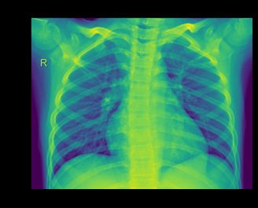
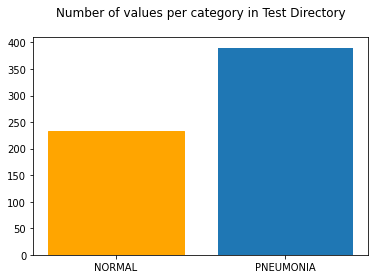
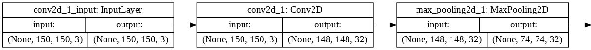
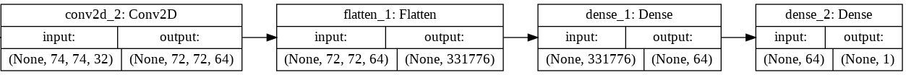

# Module 4 Final Project

<!-- #region -->
## Image Classification with Deep Learning
*Chest x-ray image of normal lungs*

This project involves building a deep neural network that trains on a large dataset for classification on a non-trivial task. In this case, the task is using x-ray images of patients to classify whether or not they have pneumonia.

## The Dataset

The dataset originates from Kermany et al. on [Mendeley](https://data.mendeley.com/datasets/rscbjbr9sj/3).

The particular subset used for this project is sourced via [Kaggle](https://www.kaggle.com/paultimothymooney/chest-xray-pneumonia). The subset contains 5,863 rgb chest x-ray images, in JPEG format. Images are organized into folders for training, validation, and testing, each of which is split into 'NORMAL' AND 'PNEUMONIA' subfolders.

## Objectives

My aim for this project was not to build a perfect model; rather the intent was to build a working model and to explore how changes to model architecture and hyperperameters can impact model accuracy. In addition, I wanted to make use of cloud computing (in this case, using Google Colab's free GPU and browser - based Jupyter Notebook) and suggest methods for distributing working models to end users.

#### Data Preparation
*Bar plot of test data counts per class*

I acquired project data from Kaggle via API, in a compressed (Zip) format, and read them into directories created within Colab's temporary environment. I then standardized, reshaped, and inspected the image data.

#### Modeling

Using the Keras library, I designed a sequentially layered convolutional neural network with Max Pooling and rectified linear activation functions (ReLU). The initial model was compiled with an RMSprop optimizer. It is a relatively fast optimizer, which independently adjusts gradient step - size for model weights.

I instantiated 'callbacks' for the model, which programatically saved model weights to the model's history whenever they improved over the previous epoch. In addition, I made use of Keras's ReduceLROnPlateau and EarlyStopping modules, set to either reduce the model's learning rate or to stop the model when its loss did not improve over a set number of epochs.


*Graphical sequence of model layers*

> Since the task was binary classification ('NORMAL' OR 'PNEUMONIA'), the model was designed to output to a sigmoid activation layer.

#### Evaluation

After building additional models, I identified the most accurate among them for distribution. I test reloading the model and report performance metrics in the project notebook.

# Featured Notebooks/Analysis

* [`student`: **Jupyter Notebook**](student.ipynb): containing code written for this project and comments explaining it.
* [`1-obtain.ipynb`: **Jupyter Notebook**](1-obtain.ipynb): containing code for loading and pre - processing data
* [`2-explore-model.ipynb`: **Jupyter Notebook**](2-explore-model.ipynb): containing code for visualization and pre - modeling EDA


### Non-Technical Presentation

* ['presentation.pdf'](presentation.pdf) summarizing  methodology, findings, and future work


# Technologies
* framework: Google Colab / Jupyter Notebook
* languages: Python
* libraries and modules:
  - Numpy
  - OS
  - Keras:
    * callbacks
    * layers
    * load_model
    * models
    * plot_model
    * optimizers
  - Scikit-Learn:
    * metrics
    * model_selection
  - Time
    ...
* visualization libraries
  - Matplotlib

<!-- #endregion -->

```python

```
